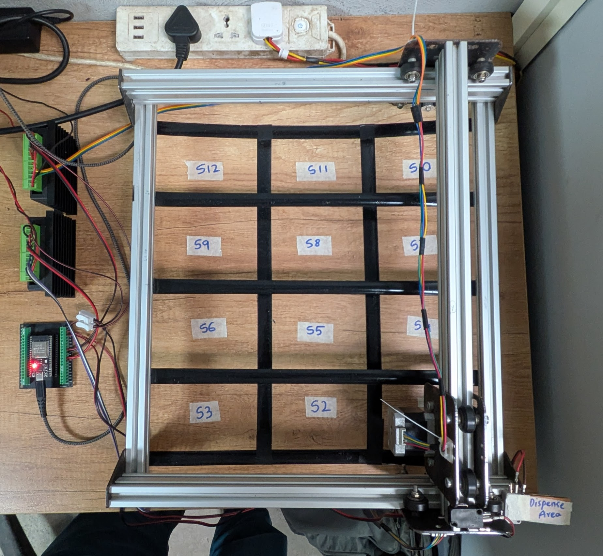
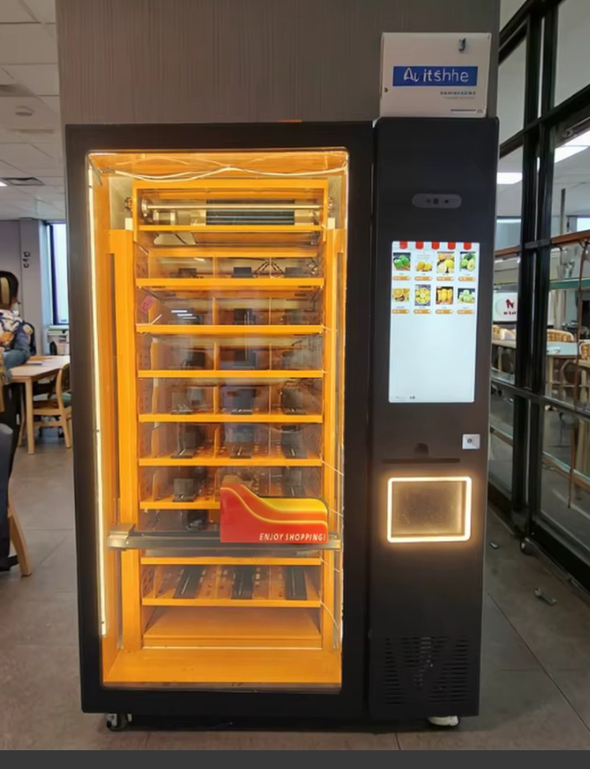

# Smart Vending Machine

## 📋 Overview
This repository contains a full-stack IoT codebase designed to orchestrate and operate physical vending machines powered by ESP32 microcontrollers. The system is split into three main modules:
1. **Firmware (`/firmware`)**: C++ code targeting the ESP32 to drive a 2D gantry dispensing mechanism via stepper motors (`AccelStepper`).
2. **Backend Services (`/backend`)**: A Fastify API server coupled with MongoDB and an MQTT broker client to handle telemetry, authentication, analytics, and dispensing commands.
3. **Admin Web Portal (`/admin_web`)**: A responsive React (Vite & Tailwind CSS) dashboard enabling B2B tenants and operators to manage machines, catalogs, orders, and view sales metrics.

---

## 🎯 Project Objective
The goal of this platform is to build a reliable, low-latency, and scalable smart vending ecosystem:
* **Precise Dispensing**: Control a 2D gantry positioning system utilizing limit switches for self-homing and coordinate-based slot target configurations.
* **Remote Management & Telemetry**: Provide vendors with live telemetry of machine health, sales analytics, and inventory levels via MQTT.
* **Multi-Tenancy**: Support multi-tenant isolation, allowing separate business entities to manage their own fleet of vending machines, operators, and item catalogs.

---

## ⚙️ Architecture & Tech Stack

### 1. Firmware (ESP32)
* **Framework**: Arduino via PlatformIO
* **Key Components**:
  * [dual_core.cpp]: Runs a FreeRTOS background task (`StepperTask`) on Core 1 for motor stepping calculations while Core 0 handles network routines. Utilizes a `74HC595` shift register to minimize native pin utilization.
  * [2d_gantry.cpp]: Handles dual-axis homing sequences using limit switches and manages coordinate slot targeting for slots `S1` through `S12`.

### 2. Backend (Fastify & MongoDB)
* **Framework**: Fastify Node.js server.
* **Key Components**:
  * [server.js]: Server entry point initializing DB connection, JWT auth, multipart file uploads, and MQTT client.
  * **Services**: MQTT subscriber/publisher services to establish real-time duplex communication with the machines.
  * **Database Models**: MongoDB collections mapping tenants, users, operators, orders, machines, and catalog items.

### 3. Admin Web (React & Vite)
* **Framework**: React, Vite, and Tailwind CSS.
* **Key Components**:
  * [App.jsx]: Entry Router.
  * **Views**: Comprehensive pages for managing tenants, catalog item assets (food items), machine slot mapping configuration, sales analytics, and live order tracking.

---

      <table>
        <tr>
          <td></td>
          <td width="40"></td> <!-- Custom gap of 40px -->
          <td></td>
        </tr>
      </table>
    

